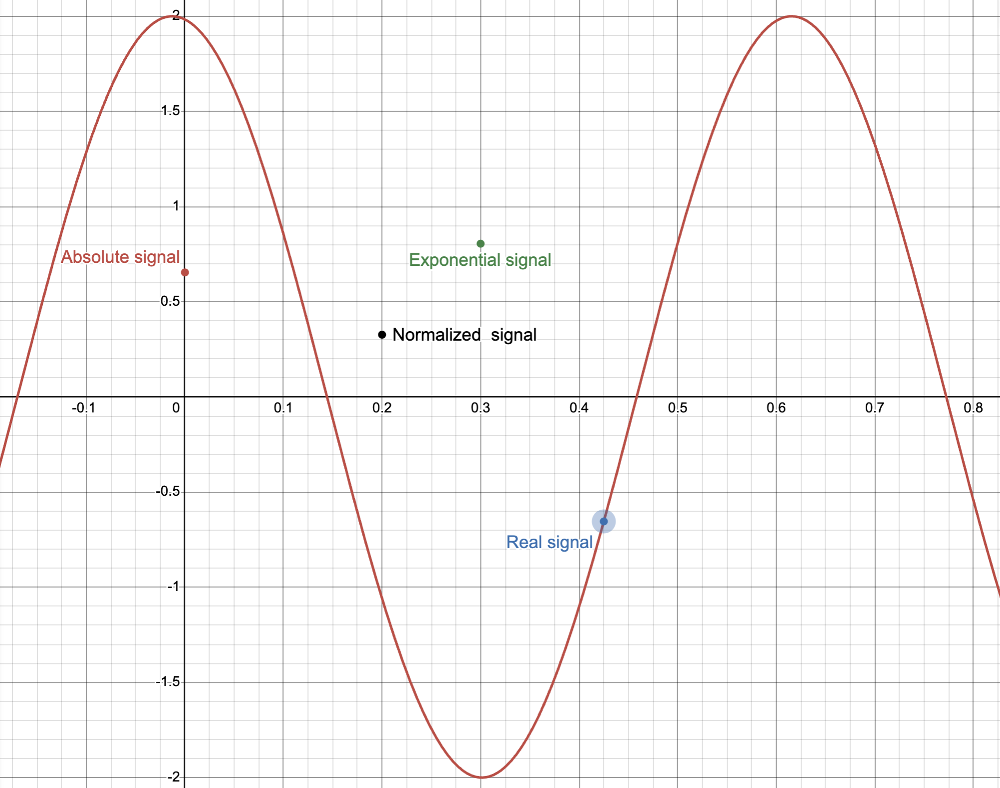
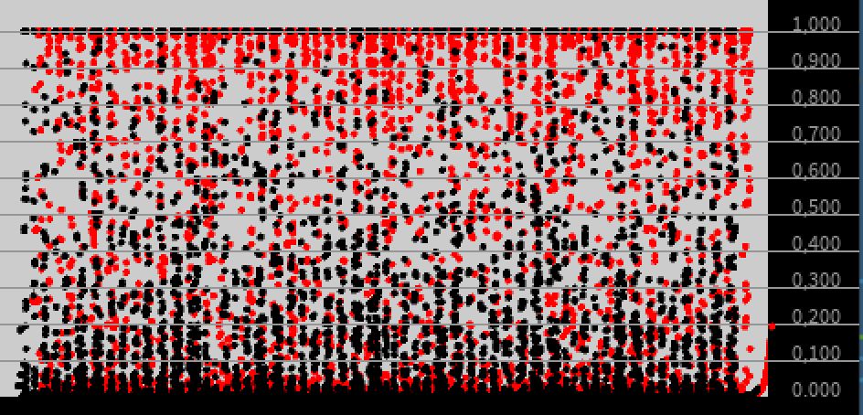
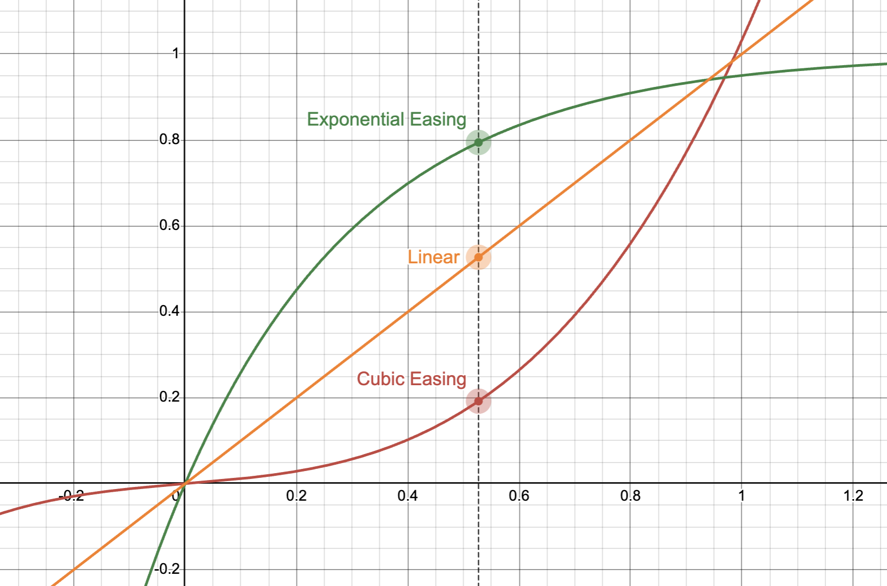
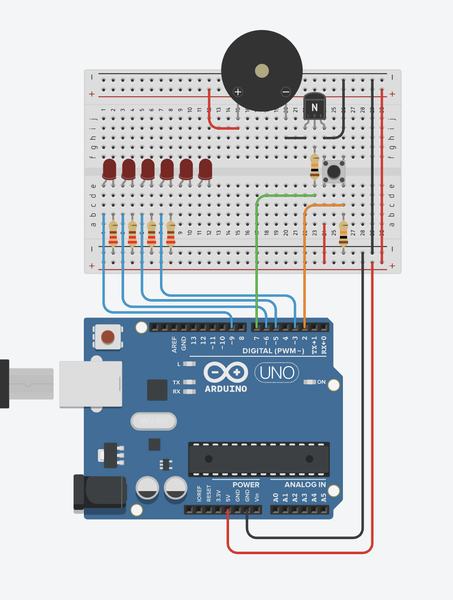

# Arduino Audio Wave Vizualization for Conversational Robots

This repository has simple examples showing how Arduino C++ code communicates with Java Processing code to visualize audio waves. Currently, it only displays a sine wave created in Processing.

This program controls an LED array based on data received through the serial port. The Java Processing application sends integers from 0 to 255. These numbers represent the state of a Furhat robot, indicating when the robot is listening ('A') or speaking (values from 0 to 255). The Arduino processes these inputs accordingly.

# Signal Processing Pipeline Documentation

(Right) Exponential mapping from normalized audio signal (Left) + Interpolation with exponential easing

## 1. Input Signal Representation

Let the incoming digital audio signal be one channel of a signed 16-bit PCM stream:

$$
x[n] \in [-1, 1]
$$

where
$( n \in \mathbb{Z}^{\ge 0} )$ is the discrete time index after normalization to floating-point.

To remove phase-dependent sign variation:

$$
x_a[n] = |x[n]|
$$

[Play with the graph here](https://www.desmos.com/calculator/7pyiils6fy)

## 2. Dynamic Peak Tracking (Adaptive Normalization)

A dynamic peak value $ P[n] $ is updated using a **decay-dominant envelope**:

Peak decay every frame:
$$
P[n] = k_d \cdot P[n-1]
$$

Instant attack if new amplitude exceeds peak:
$$
P[n] =
\begin{cases}
x_a[n] & \text{if } x_a[n] > P[n] \
k_d \cdot P[n-1] & \text{otherwise}
\end{cases}
$$

with:
$$
k_d = 0.98, \quad P[n] \ge \epsilon = 0.001
$$

The normalized amplitude becomes:
$$
x_n[n] = \frac{x_a[n]}{P[n]} \quad \in [0,1]
$$

## 3. Exponential Perceptual Mapping

A non-linear transfer function increases sensitivity to small values:

$$
y[n] = 1 - e^{-\beta x_n[n]}
$$

Here:
$$
\beta = 10
$$

This approximates human brightness perception and suppresses noise near 0.

## 4. Target Hold Mechanism

A subsampling step produces piecewise constant transitions:

Let ( N ) be the update interval (frames):
$$
N = 8
$$

Then:

$$
\text{if } n \bmod N = 0:
\quad x_c \leftarrow x_t, \quad
x_t \leftarrow y[n]
$$

where
$x_c$ = current stored value
$x_t$ = updated target value

## **5. Interpolation During Transition**

Define a normalized transition parameter for:
$
0 \le t \le 1
$
$
t = \frac{n \bmod N}{N}
$

### **(a) Linear Interpolation**

$
L(t) = (1 - t)x_c + tx_t
$

## 6. Non-Linear Easing Functions

To create smooth changes with perceptual quality, easing modifies ( t ):

### (a) Cubic Easing

$
f_{\text{cubic}}(t) = s(At^3 + Ct)
$
Clamped to 1.0

with:
$
A = 7.7, \quad C = 0.9, \quad s = 0.12
$

Then:
$
L_{cubic}(t) = (1 - f_{cubic}(t))x_c + f_{cubic}(t)x_t
$

### (b) Exponential Easing

$
f_{\text{exp}}(t) = 1 - e^{-Bt}
$
Clamped to 1.0

with:
$
B = 3.0
$

Then:
$
L_{exp}(t) = (1 - f_{exp}(t))x_c + f_{exp}(t)x_t
$

[Play with the graph here](https://www.desmos.com/calculator/4kpjhag1mf)

## 7. Final LED Control Signal

The selected perceptually-optimized mapping:

$
\boxed{u[n] = L_{exp}(t)}
$

where:
$
u[n] \in [0, 1]
$

This guarantees:

* Smooth temporal evolution
* Sensitivity to low input amplitudes
* No flicker or sharp brightness steps

## Circuits

## Bill of materials

| Name         | Quantity | Component                     |
|---------------|-----------|-------------------------------|
| U1            | 1         | Arduino Uno R3                |
| D1, D2, D3, D4, D5, D6 | 6 | Red LED                      |
| R1, R2, R3, R4 | 4        | 220 Ω Resistor                |
| S1            | 1         | Pushbutton                    |
| R5, R6        | 2         | 10 kΩ Resistor                |
| PIEZO1        | 1         | Piezo                         |
| T1            | 1         | NPN Transistor (BJT)          |

## TODO:
- [ ] Read an audio filke encoded as signed, 16 bit, little-endian linear PCM format, 16KHz, stereo (same format as WAV-files are encoded).
    - [ ] Upload and play the audio in Processing
    - [ ] Send the samples to Arduino
    - [ ] Visualized the data